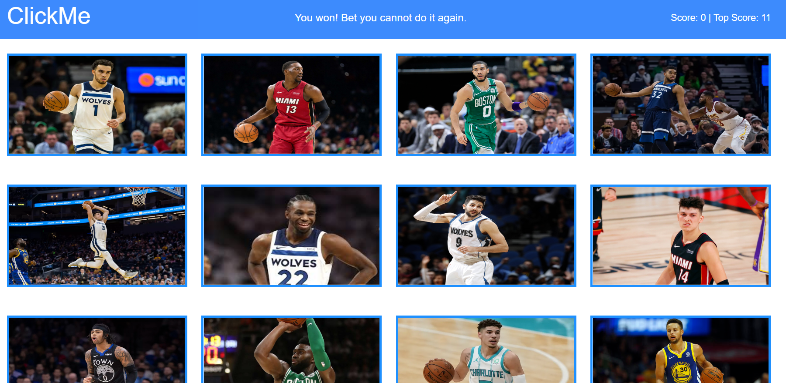

# ClickMe

Test your memory of current NBA players with the ClickMe game. ClickMe is a memory skill application built using React. The objective of the game is to be able to go through and click each player's image once. Each time you click a player's image, your score goes up by one. If you click a player's image twice, you lose and the game resets (score goes back to 0).

This project was bootstrapped with [Create React App](https://github.com/facebookincubator/create-react-app).

You can find the most recent version of this guide [here](https://github.com/facebookincubator/create-react-app/blob/master/packages/react-scripts/template/README.md).

## Table of contents

* [Live](#live)
* [Screenshots](#screenshots)
* [About this project](#about-this-project)
* [Getting started](#getting-started)
* [Deployment](#react-deployment)
* [Technologies used to create app](#technologies-used)
  * [Backend technologies](#Backend)
  * [Frontend technologies](#Frontend)
* [Issues](#Issues)

## Live

<https://clickme-game.herokuapp.com/>

##  Screenshots

 
 

 
 

##  About this project

* [How the app works](#how-app-works)
* [How the app is built](#how-the-app-is-built)
* [What is web scraping?](#about-web-scraping)

###  How the app works

###  How the app is built

This project was built using React, which is an open-source Javascript library developed at Facebook specifically for the task of developing user interfaces. React relies on a component-based architecture where elements of the user interface are broken into self-contained components.

For a high level overview of React, check out this video: <https://www.youtube.com/watch?v=x7cQ3mrcKaY>

For more information on how this project is structured and broken into various components, see [Structure of the project](#structure-of-project)

##  Getting started

The following section will take you through the steps of setting up this application and getting it running locally on your computer.

If you don't want to set up this project locally and just want to see the deployed application, go to <https://clickme-game.herokuapp.com/>.

To set up this application locally on your computer, perform the following steps:

1. [Clone the repository](#clone-repository)

2. [Install Node.js](#install-node)

3. [Install the dependencies](#dependencies)

4. [Start the server](#start-server)

###  1. Clone the repository

The first step is to clone the project repository to a local directory on your computer. To clone the repository, run the following commands:
<pre>
  git clone https://github.com/philipstubbs13/ClickMe.git
  cd ClickMe
</pre>

####  Structure of the project

After you clone the repository, navigate to the project root directory (ClickMe). The project directory structure is set up as follows:

<ul>
  <li>
    
<b>server.js</b>: This file does the following:

  <li>
    
<b>public</b>

  </li>
  <li>
    
<b>src</b>

  </li>
  <li><b>package.json</b>: Lists the project dependencies (third party npm packages) and their version numbers.</li>
  <li><b>.gitignore</b>: Anything listed inside this file (for example, node_modules) will not be tracked by GitHub when code is committed.</li>
  <li><b>yarn.lock</b>: Dependency tree for the project. Lists all the dependencies and their versions.</li>
</ul>

###  2. Install Node.js

If you don't already have Node.js installed on your computer, you can install the latest version here: <https://nodejs.org/en/>.

###  3. Install the dependencies

This project uses React.

After you clone the repository to a local directory, change directory to the project root directory and run the following command to install the required React dependencies (react, react-dom, and react-scripts).

<pre>npm install</pre>

Version information for each of these packages is available in the <b>package.json</b> file in the project root directory.

### <a name="start-server">4. Start the application</a>

After performing all of the setup steps in the <b>Getting started</b> section, navigate to the project root directory (ClickMe) and run the following command to start the application:

<pre>
yarn start
</pre>

To verify that the application has started and is working locally on your computer, open Chrome and go to <a href="http://localhost:3000">http://localhost:3000</a>.

##  Deployment

To deploy your react app to Heroku, see [Deploying React with Zero Configuration](https://blog.heroku.com/deploying-react-with-zero-configuration).

##  Technologies used to build app

* [Backend technolgies](#Backend)
* [Frontend technologies](#Frontend)

###  Backend technologies

* Node.js (<https://nodejs.org/en/>)
* Express (<http://expressjs.com/>)

###  Frontend technologies

* HTML
* CSS
* Bootstrap (<http://getbootstrap.com/>)
* Javascript
* React (<https://reactjs.org/>)

##  Issues

If you find an issue while using the app or have a request, <a href="https://github.com/philipstubbs13/ClickMe/issues/" target="_blank">log the issue or request here</a>. These issues will be addressed in a future code update.
